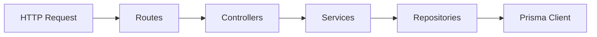

# University Web System — Master Architecture & Development Roadmap

This document is the authoritative master plan for the University Web System. It aligns with [1-requirements-and-actors.md](1-requirements-and-actors.md), [2-database-schema.md](2-database-schema.md), [3-architecture.md](3-architecture.md), and [4-api-and-ui-guidelines.md](4-api-and-ui-guidelines.md). Revise milestones and sequencing when scope or constraints change.

---

## 1. Executive summary

The system is a **unified portal** for public information, digital library, and academic/student-affairs workflows, backed by **PostgreSQL + Prisma**, **Express (MVCS + SOLID)**, and **React (Router + React Query + Redux Toolkit + Tailwind)**. Implementation follows the milestones **M0–M11** below.

---

## 2. Architecture analysis

### 2.1 Domain model (five bounded areas)

| Domain | Primary tables (from [2-database-schema.md](2-database-schema.md)) | Main actors |
|--------|--------------------------------------------------------------------------------|-------------|
| Identity & access | `users` | All authenticated roles; Visitor is unauthenticated |
| University structure | `colleges`, `departments`, `courses`, `faculty_courses` | Public; Manager; Faculty |
| Academic & affairs | `students`, `enrollments`, `exam_results`, `grade_appeals`, `transcript_requests` | Student; Faculty; Admin; Affairs |
| Library | `books`, `book_keywords` | Visitor/Student read; Librarian CRUD |
| Content & compliance | `news`, `audit_logs` | Managers (college news); Admin (global); all critical mutations logged |

### 2.2 Role mapping (requirements vs schema)

From [1-requirements-and-actors.md](1-requirements-and-actors.md) and `users.role` enum:

- **Visitor:** No `users` row; access only to public routes (news, structure, library listing/search, faculty directory).
- **STUDENT:** Student services (enrollments, results, appeals, transcripts), library read/download counters.
- **FACULTY:** Inherits student capabilities in product terms; additionally grade entry, analytics, book suggestions (if modeled later—schema today links `faculty_courses`; “suggest books” may be a follow-up feature or simple API extension).
- **LIBRARIAN:** Library CRUD and file upload paths.
- **MANAGER (College Manager):** Scoped by `users.college_id`—college news, college-scoped structure visibility/edits per future policy (schema: `news.college_id`).
- **AFFAIRS (Student Affairs):** Students profiles/enrollments/records, transcript fulfillment (`transcript_requests`).
- **ADMIN:** Users, global news, appeals queue, high-level analytics, RBAC overrides.

**RBAC principle:** Controllers authorize; **Services enforce invariants** (e.g., appeal only on own `exam_result`, faculty only own `faculty_course_id`, manager only own college).

### 2.3 Backend layering (MVCS — strict)

Aligned with [3-architecture.md](3-architecture.md):

| Layer | Responsibility | SOLID tie-in |
|-------|----------------|--------------|
| **Routes** | Mount paths, middleware (auth, rate limit), map to controller | Single responsibility per resource group |
| **Controllers** | Parse/validate input (e.g. Zod/Joi), call **one** service method, map errors to HTTP | No business logic; thin |
| **Services** | Business rules: GPA, appeal eligibility, enrollment rules, transcript state machine | Open/closed via strategy/helpers; dependency on repository **interfaces** |
| **Repositories** | Prisma queries only; no HTTP, no cross-aggregate orchestration | Interface segregation: small repo methods per aggregate |
| **Models** | Prisma schema = single source of truth | Types derived from DB |

**Dependency inversion:** Services depend on repository abstractions (TypeScript interfaces + concrete Prisma implementations) to keep services unit-testable with mocks.

### 2.4 API surface (from [4-api-and-ui-guidelines.md](4-api-and-ui-guidelines.md))

Group routers under `/api/auth`, `/api/users`, `/api/structure`, `/api/academic`, `/api/student-services`, `/api/library`. JWT in `Authorization` header; `GET /api/users/me` for hydration.

**Cross-cutting:** Consistent error format, `audit_logs` writes from services or a dedicated **AuditService** invoked after successful mutations (not scattered in controllers).

### 2.5 Frontend layering

From [3-architecture.md](3-architecture.md) and [4-api-and-ui-guidelines.md](4-api-and-ui-guidelines.md):

- **Routes + layouts:** `PublicLayout`, `StudentLayout`, `FacultyLayout`, `AdminLayout` (+ **Affairs** and **Manager** layouts—either separate sidebars or merged into Admin with RoleGuard; recommend explicit **AffairsLayout** and **ManagerLayout** for clarity and least privilege in navigation).
- **Redux Toolkit:** `authSlice` (user + role + token metadata), optional `themeSlice`.
- **React Query:** All server state; custom hooks in `api/` or `hooks/` wrapping `useQuery`/`useMutation`.
- **Styling & UI kit:** **Tailwind CSS** (v4 + Vite plugin); shared primitives under **`client/src/components/ui`** (`Button`, `Input`, `Card`, `DataTable`, `Pagination`, `FeedList`, charts wrappers, etc.) so feature pages compose from the kit instead of ad-hoc raw markup.
- **Feedback:** **Sonner** toasts for auth and mutations; centralized **Axios** instance (`api/http.ts`) with JWT and error handling.
- **Analytics (dashboards):** **Recharts** on admin/faculty dashboards where KPIs and trends are shown.
- **Components:** `components/common` for cross-cutting guards only (e.g. `RoleGuard`); reusable presentation lives in **`components/ui`**.

### 2.6 Key business flows (service-centric)

1. **Grades:** Faculty `POST` results → unique constraint per student/faculty_course/attempt → Student reads aggregated GPA in service.
2. **Appeals:** Student submits → Admin reviews → status + `admin_response`; audit each transition.
3. **Transcripts:** Student requests → Affairs uploads `file_path` + status to DELIVERED; storage strategy (local vs S3) decided in infrastructure phase.
4. **Library:** Upload increments metadata; `PATCH` read/download for analytics integrity (idempotent or guarded in service).

---

## 3. Development roadmap (phases, milestones, tasks)

Phases are **sequential** where dependencies exist; some tasks within a phase can run in parallel (marked **‖**).

### Phase 0 — Foundation & governance (Milestone: **M0 — Repo ready**)

- Monorepo vs split: choose **one** repo with `client/` and `server/` (or `frontend/`/`backend/`) for clarity.
- Tooling: ESLint, Prettier, TypeScript strict, commit hooks (lint on staged).
- Environment: `.env.example` for `DATABASE_URL`, `JWT_SECRET`, file upload root/base URL.
- **Definition of Done:** `pnpm`/`npm` scripts; both apps boot empty; CI placeholder (lint only).

### Phase 1 — Database & Prisma (Milestone: **M1 — Schema migrated**)

- Implement Prisma schema exactly per [2-database-schema.md](2-database-schema.md): enums, relations, unique constraints (`exam_results`, `users.email`, `students.academic_number`, `courses.code`).
- Migrations workflow; seed script for dev roles and sample colleges/departments.
- **‖** Document invariants that services must enforce (e.g., FACULTY on `faculty_courses`, LIBRARIAN on `books.added_by`)—some as DB checks where feasible, rest in services.

### Phase 2 — Backend core: app shell, auth, RBAC (Milestone: **M2 — Authenticated API**)

- Express app: middleware order (cors, json, error handler), health route.
- **MVCS scaffolding:** `routes/`, `controllers/`, `services/`, `repositories/` per domain module (auth, users, structure, academic, student-services, library).
- Auth: `POST /api/auth/login` (hash verify, JWT), auth middleware decoding JWT attaching `req.user`.
- `GET /api/users/me`.
- **RBAC middleware:** role bitmask or allowed-roles array; compose with route-level declarations.
- Password hashing (bcrypt/argon2); never return password hash.
- **Testing:** unit tests for auth service + JWT edge cases; supertest for login/me.

### Phase 3 — Structure & public read APIs (Milestone: **M3 — Public data**)

- `GET /api/structure/colleges|departments|courses` with filters per spec.
- `GET /api/users/faculty` (join users + departments/colleges via `faculty_courses` or profile rules).
- **Testing:** repository integration tests with test DB.

### Phase 4 — Academic module (Milestone: **M4 — Grades & analytics**)

- Enrollments: `GET /api/academic/enrollments/me` (student).
- Results: `GET /api/academic/results/me` with **GPA in service**; `POST /api/academic/results` (faculty, scoped faculty_course).
- Analytics: `GET /api/academic/results/analytics` (faculty own courses; admin broader—define rules in service).
- **Audit:** grade create/update → `audit_logs`.
- **Testing:** GPA calculation cases; authorization matrix (student cannot post grades).

### Phase 5 — Student services (Milestone: **M5 — Appeals & transcripts**)

- Appeals: `POST` (student), `GET` list (admin), `PATCH` status (admin) + notifications placeholder.
- Transcripts: `POST` (student), `PATCH` (affairs) file path + status.
- State machines in services (valid status transitions).
- **Testing:** appeal on wrong result rejected; affairs cannot approve appeals unless specified.

### Phase 6 — Library module (Milestone: **M6 — Files & counters**)

- `GET /api/library/books` pagination + keyword filter (join `book_keywords`).
- `POST` multipart upload (librarian); persist `file_path`; keywords handling.
- `PATCH` read/download counters (service: optional debounce vs always increment per product rule).
- **Testing:** upload size/type limits; RBAC.

### Phase 7 — News & audit completeness (Milestone: **M7 — Content & observability**)

- News CRUD (split: global admin vs college manager by `college_id`).
- Centralize **AuditService** and ensure all sensitive endpoints call it.
- Admin “system logs” UI backed by `audit_logs` pagination.

### Phase 8 — Frontend foundation (Milestone: **M8 — Shell & auth UX**)

- Vite + React + TS + **Tailwind CSS**; Router; QueryClient; Redux store.
- **Axios** instance with interceptors (JWT) and optional toast on transport errors.
- Build **`components/ui`** primitives first (`Button`, `Input`, `Card`, `DataTable`, `Pagination`, `PageHeader`, `Alert`, etc.), then feature pages that compose them.
- **Sonner** for login and mutation feedback.
- Public pages: landing, news list, structure browser, faculty directory, library search.
- Login flow → hydrate `authSlice` + React Query cache.

### Phase 9 — Role layouts & feature UIs (Milestone: **M9 — Role-complete UI**)

- **‖** Student: dashboard, courses, grades, appeals form, transcript request.
- **‖** Faculty: classes, grade entry, analytics charts/tables.
- **‖** Librarian: book management UI (table + upload).
- **‖** Manager: college-scoped news and structure management (per requirements).
- **‖** Affairs: student records, transcript processing UI.
- **‖** Admin: users, global news, appeals review, logs.
- All data via React Query hooks; RoleGuard for controls.

### Phase 10 — Quality, security, performance (Milestone: **M10 — Hardened**)

- Input validation on all write DTOs; output DTOs to avoid leaking internal fields.
- Rate limiting on auth; helmet/cors; file upload virus scan (optional stretch).
- E2E (Playwright/Cypress): critical paths login → grade view → appeal.
- Load basics: pagination everywhere; DB indexes (foreign keys, frequent filters).

### Phase 11 — Deployment (Milestone: **M11 — Production-ready**)

- PostgreSQL managed or container; run migrations in release step.
- **Backend:** process manager or container; persistent volume for PDFs or cloud object storage.
- **Frontend:** static build behind CDN/reverse proxy; env for `VITE_API_URL`.
- CI/CD: lint, test, build, migrate; secrets in vault/GitHub Actions.
- Backup strategy for DB and files.

---

## 4. Implementation order (professional sequencing)

1. **M0** tooling → **M1** schema/seed → **M2** auth/RBAC shell.
2. **M3** public structure (unblocks frontend public shell).
3. **M4** academic (core value: grades/GPA).
4. **M5** appeals/transcripts (workflow on top of results).
5. **M6** library (parallelizable with M5 after M2 if teams split).
6. **M7** news/audit polish.
7. **M8–M9** frontend in parallel tracks after **M2** (API-first) with continuous integration.
8. **M10–M11** hardening and release.

---

## 5. SOLID & MVCS checklist (ongoing)

- **S:** One class/file per layer concern; split bloated services by subdomain.
- **O:** Extend behavior via new service helpers/strategies, not editing giant switches.
- **L:** Repository interfaces with consistent contracts for test doubles.
- **I:** Small repository methods vs one “god” repository.
- **D:** Services depend on interfaces; wire Prisma repos in composition root (`app.ts` / DI container if introduced).
- **MVCS:** If business logic appears in a controller, move it to a service.

---

## 6. Localization, RTL, and i18n (Arabic primary)

- **Primary locale:** Arabic (`ar`), with English (`en`) as fallback/secondary — see [6-i18n-rtl-architecture.md](6-i18n-rtl-architecture.md).
- **M8–M9:** When building pages and layouts, wire all user-visible copy through `react-i18next`, keep translation files under `client/src/locales/`, and verify each major screen in both `dir="rtl"` and `dir="ltr"`.
- **Styling:** Prefer logical properties / RTL-aware Tailwind patterns so components do not need one-off mirrors for every margin.
