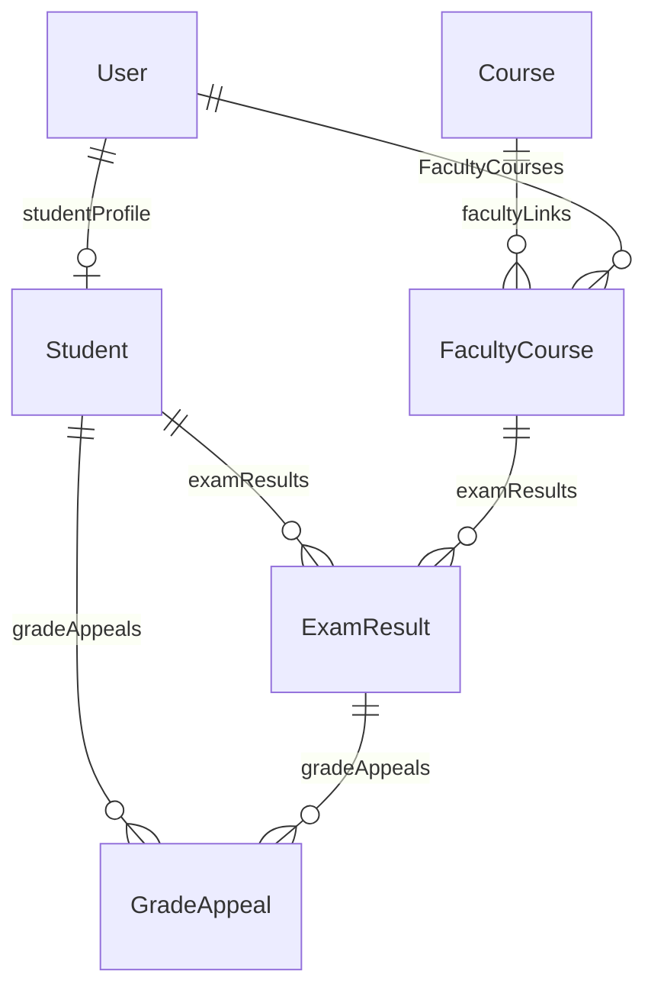

# University Web System — Project Status Report

**Report date:** 2026-05-12  
**Scope:** Summary of what has been implemented to date in this repository, how the data model and backend layers fit together, how to verify the build, and what the [master plan](5-master-plan.md) prescribes next.

**Related documentation:** [5-master-plan.md](5-master-plan.md), [1-requirements-and-actors.md](1-requirements-and-actors.md), [2-database-schema.md](2-database-schema.md), [3-architecture.md](3-architecture.md), [4-api-and-ui-guidelines.md](4-api-and-ui-guidelines.md), [6-i18n-rtl-architecture.md](6-i18n-rtl-architecture.md).

---

## 1. Executive summary

The system is a **monorepo** with:

| Layer | Technology |
|--------|------------|
| Database | PostgreSQL, **Prisma ORM** ([server/prisma/schema.prisma](../server/prisma/schema.prisma)) |
| API | **Express** (MVCS-style domains), JWT auth, Zod validation where used, Helmet, CORS, rate limiting on selected routes |
| Web app | **Vite + React 18 + TypeScript**, React Router, TanStack React Query, Redux Toolkit (**auth**, **theme**), **Tailwind CSS v4**, **Axios**, **Sonner**, **Recharts**, **Lucide React** |

Milestones **M0–M9** from [5-master-plan.md](5-master-plan.md) are largely reflected in code (foundation through role-complete UI). The **next formal milestones** are **M10 (hardening)** and **M11 (production deployment)**.

---

## 2. Repository structure (files and folders)

### 2.1 Root

| Path | Role |
|------|------|
| [package.json](../package.json) | npm **workspaces** (`client`, `root` scripts: `lint`, `test`, `build`, `db:seed`, dev shortcuts) |
| [.github/workflows/ci.yml](../.github/workflows/ci.yml) | CI: `npm ci`, `lint`, `test`, `build` on `main`/`master` and PRs |
| [.env.example](../.env.example) | Template env vars (`DATABASE_URL`, `JWT_SECRET`, upload paths, etc.) |

### 2.2 Server (`server/`)

| Path | Role |
|------|------|
| [server/src/app.ts](../server/src/app.ts) | **Composition root:** constructs repositories, services, controllers; mounts routers and static `/uploads` |
| [server/src/index.ts](../server/src/index.ts) | HTTP server bootstrap |
| [server/src/config.ts](../server/src/config.ts) | Environment configuration |
| [server/src/lib/prisma.ts](../server/src/lib/prisma.ts) | Shared Prisma client |
| [server/src/middleware/](../server/src/middleware/) | `authenticate`, `requireRoles`, `errorHandler` |
| [server/src/domains/](../server/src/domains/) | **Per-domain MVCS modules** (see §5) |
| [server/prisma/schema.prisma](../server/prisma/schema.prisma) | Canonical schema |
| [server/prisma/seed.ts](../server/prisma/seed.ts) | Dev seed data |
| [server/prisma/migrations/](../server/prisma/migrations/) | Applied migrations (e.g. initial migration under `20260512160822_init/`) |

**Domain folders** (each typically includes `*.routes.ts`, `*.controller.ts`, `*.service.ts`, `*.repository.ts`, and `*.schemas.ts` where validation exists):

- `auth/` — login, register  
- `users/` — `me`, faculty directory, admin user list/patch  
- `structure/` — colleges, departments, courses (read)  
- `academic/` — enrollments, results, GPA path, faculty grade post, analytics  
- `studentServices/` — appeals, transcripts  
- `library/` — book list, PDF upload, read/download counters  
- `news/` — CRUD API (scoped by role in service)  
- `admin/` — dashboard aggregates, audit log pagination  
- `audit/` — centralized audit logging service/repository  

### 2.3 Client (`client/`)

| Path | Role |
|------|------|
| [client/src/main.tsx](../client/src/main.tsx) | React root, providers (Redux, Query, i18n) |
| [client/src/App.tsx](../client/src/App.tsx) | Router, theme + auth bootstrap, Sonner |
| [client/src/routes/AppRouter.tsx](../client/src/routes/AppRouter.tsx) | All routes and `RoleRoute` / `ProtectedRoute` |
| [client/src/layouts/](../client/src/layouts/) | `PublicLayout`, `DashboardShell`, role shells (`AdminLayout`, `StudentLayout`, …) |
| [client/src/pages/](../client/src/pages/) | Screen components per route |
| [client/src/api/http.ts](../client/src/api/http.ts) | Axios instance, JWT, interceptors |
| [client/src/api/hooks.ts](../client/src/api/hooks.ts) | React Query hooks |
| [client/src/components/ui/](../client/src/components/ui/) | Reusable UI primitives (buttons, tables, charts usage, theme toggle, etc.) |
| [client/src/store/](../client/src/store/) | `authSlice`, `themeSlice`, store config |
| [client/src/i18n/](../client/src/i18n/), [client/src/locales/](../client/src/locales/) | Arabic / English |

### 2.4 Documentation (`docs/`)

Specification and planning artifacts live alongside this report, including [5-master-plan.md](5-master-plan.md) and the numbered requirement/architecture files linked in §1.

### 2.5 Notable client dependencies (traceability)

Representative entries from [client/package.json](../client/package.json): `@tanstack/react-query`, `@reduxjs/toolkit`, `axios`, `react-router-dom`, `tailwindcss`, `@tailwindcss/vite`, `sonner`, `recharts`, `react-is` (peer for Recharts), `lucide-react`, `i18next`, `react-i18next`, `clsx`, `tailwind-merge`.

---

## 3. Programming logic — how tables relate (grades and beyond)

The schema file [server/prisma/schema.prisma](../server/prisma/schema.prisma) is the single source of truth; [2-database-schema.md](2-database-schema.md) is the written spec.

### 3.1 Identity and structure

- **User** may belong to a **College** (`collegeId` optional). Role is `UserRole` (ADMIN, STUDENT, FACULTY, LIBRARIAN, AFFAIRS, MANAGER).  
- **College** has **Department**s; **Department** has **Course**s.  
- **FacultyCourse** links a **User** (faculty) to a **Course** for a given **semester** and **academic year**. This row is the “section offering” faculty teach.

### 3.2 Students, enrollments, and grades

- **Student** has a **1:1** link to **User** (`userId` unique) and belongs to a **Department**.  
- **Enrollment** links **Student** to **Course** (planning/registration context for a semester/year).  
- **ExamResult** is the grade row: it links **Student** + **FacultyCourse** + **attemptNumber**, with a **unique** constraint on `(studentId, facultyCourseId, attemptNumber)`. The **score** and metadata live here.  
- **Implication:** A student’s grades are attached through **Student → ExamResult**, while each result also points at the **FacultyCourse** that identifies which faculty-taught section the grade belongs to.

### 3.3 Appeals and transcripts

- **GradeAppeal** links **Student** and **ExamResult** (student challenges a specific posted result).  
- **TranscriptRequest** links **Student** to a status workflow (`PENDING` → `PROCESSED` → `DELIVERED`, etc.) and optional **filePath** when delivered.

### 3.4 Library, news, audit

- **Book** belongs to **Department**, references **User** as **addedBy**, and has **BookKeyword** children.  
- **News** has an **author** **User** and optional **College** for college-scoped posts.  
- **AuditLog** records **action** / **entity** / **entityId** (and optional JSON **details**) with a **userId** and timestamp for traceability on sensitive operations.

### 3.5 Diagram (grades path)



---

## 4. Technical steps — commands and verification

This section documents **standard commands** used in development and **CI**. It does not claim every historical command run on a specific machine.

### 4.1 Install

From repository root:

```bash
npm ci
```

(Local development may use `npm install` when not reproducing CI exactly.)

### 4.2 Lint, test, build (whole workspace)

```bash
npm run lint
npm run test
npm run build
```

These match the steps in [.github/workflows/ci.yml](../.github/workflows/ci.yml). The **client** workspace runs **ESLint** and **Vite/TypeScript build**; the **server** workspace runs **ESLint**, **Vitest**, and **tsc** build.

### 4.3 Run dev servers

```bash
npm run dev:server
npm run dev:client
```

### 4.4 Database (environment-dependent)

Requires a valid **`DATABASE_URL`** (see [.env.example](../.env.example)).

Typical Prisma workflow from `server/` (or via `npm run` with `--workspace=server`):

| Command | Purpose |
|---------|---------|
| `npx prisma generate` | Regenerate Prisma Client ([server/package.json](../server/package.json) `prisma:generate`) |
| `npx prisma migrate dev` | Apply/create migrations in development (`prisma:migrate`) |
| `tsx prisma/seed.ts` / `npx prisma db seed` | Load seed data (`prisma:seed` / root `npm run db:seed`) |
| `npx prisma studio` | Inspect data (`prisma:studio`) |

A baseline migration exists under [server/prisma/migrations/](../server/prisma/migrations/). New environments must run migrations before the API can run against the DB.

---

## 5. MVCS architecture — yes, and how

**MVCS is used on the backend:** each bounded area under [server/src/domains/](../server/src/domains/) follows the layering described in [3-architecture.md](3-architecture.md) and [5-master-plan.md](5-master-plan.md):

| Layer | Responsibility |
|-------|----------------|
| **Routes** | Mount paths, compose `authenticate` / `requireRoles`, rate limits, multer |
| **Controllers** | Parse/validate input (often via Zod), call one service method, return HTTP responses |
| **Services** | Business rules: GPA, eligibility, transcript transitions, news scoping, audit calls |
| **Repositories** | Prisma access only; no HTTP |

**Composition / dependency injection** is done explicitly in [server/src/app.ts](../server/src/app.ts): repositories are instantiated with `prisma`, services receive repositories (and **AuditService** where needed), controllers receive services, routers receive controllers.

**Cross-cutting:** JWT authentication, role checks, centralized **AuditService**, global error handler.

---

## 6. HTTP API surface (by prefix)

Authoritative wiring: [server/src/app.ts](../server/src/app.ts).

| Prefix | Endpoints (method + path) | Notes |
|--------|---------------------------|--------|
| **/api/auth** | `POST /login`, `POST /register` | Rate limit on router |
| **/api/users** | `GET /faculty` (public); `GET /me` (auth); `GET /`, `PATCH /:id` (ADMIN) | |
| **/api/structure** | `GET /colleges`, `GET /departments`, `GET /courses` | Public read |
| **/api/academic** | All routes authenticated; `GET /enrollments/me`, `GET /results/me` (STUDENT, FACULTY); `POST /results` (FACULTY); `GET /results/analytics` (FACULTY, ADMIN) | |
| **/api/student-services** | All authenticated; appeals (create STUDENT/FACULTY; list/patch status ADMIN); transcripts (request + me STUDENT/FACULTY; list/patch AFFAIRS, ADMIN) | |
| **/api/library** | `GET /books` (public); `PATCH /books/:id/read`, `PATCH /books/:id/download` (rate limited, unauthenticated in routes); `POST /books` (LIBRARIAN, multipart PDF) | |
| **/api/news** | `GET /`, `GET /:id` (public); `POST /`, `PATCH /:id`, `DELETE /:id` (ADMIN, MANAGER) | |
| **/api/admin** | `GET /dashboard`, `GET /audit-logs` (ADMIN) | |

Static files: **`GET /uploads/*`** via Express static from configured upload directory.

---

## 7. Actor capability matrix (backend + UI)

Below: what is **implemented in the API** (with role constraints) and the **primary React screens** wired in [client/src/routes/AppRouter.tsx](../client/src/routes/AppRouter.tsx). Items marked “API only” have no dedicated UI in this repo or are only partially covered.

| Actor | Backend capabilities | Frontend pages / areas (representative) |
|--------|----------------------|-------------------------------------------|
| **Visitor** | Public: structure read, faculty directory, library list + counters, news list/detail | [HomePage](../client/src/pages/HomePage.tsx), [NewsPage](../client/src/pages/NewsPage.tsx), [FacultyDirectoryPage](../client/src/pages/FacultyDirectoryPage.tsx), [LibraryPage](../client/src/pages/LibraryPage.tsx) |
| **STUDENT** | Academic: own enrollments, own results/GPA path; student services: create appeal, request/list transcripts; library as visitor | `/student/*`: dashboard, courses, grades, appeals, transcripts |
| **FACULTY** | Same student routes where shared; post **ExamResult**; course analytics; appeals/transcripts as student | `/faculty/*` plus linked `/student/*` paths in [FacultyLayout](../client/src/layouts/FacultyLayout.tsx): classes, grades, [FacultyAnalyticsPage](../client/src/pages/FacultyAnalyticsPage.tsx) |
| **ADMIN** | List/patch users; academic analytics; full appeals queue; transcript list/patch; admin dashboard + audit logs; global news API | `/admin/*`: [AdminDashboardPage](../client/src/pages/AdminDashboardPage.tsx), users, news, appeals, logs |
| **AFFAIRS** | List/patch transcript requests | `/affairs/*`: dashboard, [AffairsTranscriptsPage](../client/src/pages/AffairsTranscriptsPage.tsx) |
| **MANAGER** | News create/update/delete **API** (scoped in service); college id on posts | `/manager/*`: dashboard, [ManagerNewsPage](../client/src/pages/ManagerNewsPage.tsx) (create flow; **no** full news CRUD UI or **structure management** UI in repo) |
| **LIBRARIAN** | PDF book upload | `/librarian/*`: dashboard, [LibrarianBooksPage](../client/src/pages/LibrarianBooksPage.tsx) |

**Documented gaps (honest scope):**

- **Manager “structure management”** called out in [5-master-plan.md](5-master-plan.md) M9 is **not** implemented as a dedicated manager UI; **structure** API is **read-only** ([structure.routes.ts](../server/src/domains/structure/structure.routes.ts)).  
- **News** `PATCH` / `DELETE` exist on the API for ADMIN/MANAGER; the **client** focuses on listing (admin) and **create** (manager), not a full in-app editor for every operation.  
- **Auth register:** `POST /api/auth/register` exists; the SPA may emphasize **login** only—confirm product expectations for self-registration.

---

## 8. Master plan alignment and next steps

### 8.1 Where we are

Per [5-master-plan.md](5-master-plan.md), phases **M0–M9** cover:

- Tooling and repo layout (**M0**)  
- Prisma schema, migrations, seed (**M1**)  
- Express MVCS, JWT, RBAC (**M2**)  
- Public structure + faculty directory (**M3**)  
- Academic module: enrollments, results, GPA, analytics (**M4**)  
- Appeals and transcripts (**M5**)  
- Library upload + counters (**M6**)  
- News + audit + admin logs (**M7**)  
- React foundation: Tailwind, UI kit, Axios, Query, auth UX (**M8**)  
- Role layouts and module UIs (**M9**)

The codebase reflects these areas; remaining polish items include **M9** gaps above where requirements demand them.

### 8.2 Next milestone (M10 — Hardened)

Recommended next work from [5-master-plan.md](5-master-plan.md) §Phase 10:

- Broader **input/output validation** and DTO shaping on write/read paths  
- **E2E tests** (Playwright or Cypress): e.g. login → grades → appeal  
- Security/performance hardening: review rate limits, upload policy, indexing  
- Optional: complete **manager** tools (structure) if required by [1-requirements-and-actors.md](1-requirements-and-actors.md)

### 8.3 Following milestone (M11 — Production-ready)

- Managed PostgreSQL or container; **migrate** in release pipeline  
- Backend hosting + **upload volume** (or object storage)  
- Static **frontend** build with `VITE_API_URL`  
- **Secrets** management and **backup** strategy for DB and files  

### 8.4 Suggested “next task” for the team

Pick one track to start **M10**:

1. **E2E** critical path coverage in CI, or  
2. **Validation + response DTO** pass on all mutating endpoints, or  
3. **Close product gaps** (manager structure UI, news edit/delete UI) if the requirements doc mandates them before release.

---

## 9. Document history

| Version | Date | Notes |
|---------|------|--------|
| 1.0 | 2026-05-12 | Initial status report added under `docs/Status_Report.md`. |
